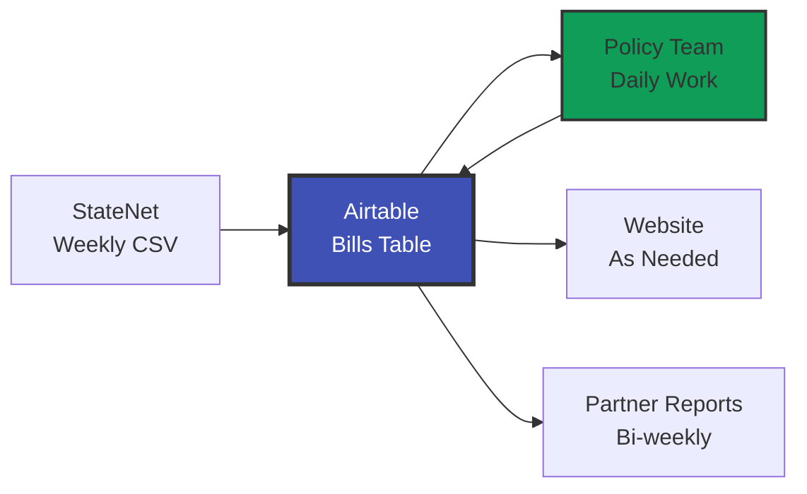
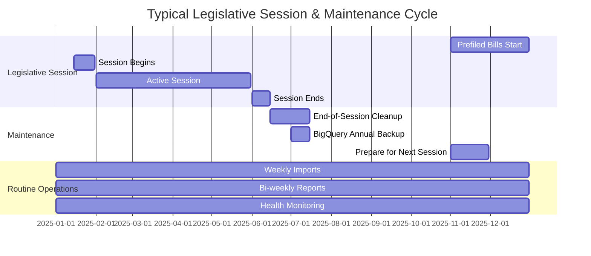

# Annual Operations Guide

Understanding the yearly workflow and maintenance tasks for the Legislative Tracker.

## Current System Design (Pragmatic Approach)

!!! success "Simple & Sustainable"
    **Primary system**: Airtable - Everything happens here

    **Backup system**: BigQuery - Annual snapshot for safekeeping

    **Dashboard**: Airtable native Interface - No custom builds needed

---

## The Annual Cycle

### Throughout the Legislative Session (January - June typically)



**What happens**:
1. **Weekly**: Import StateNet CSV → Airtable
2. **Daily**: Policy team reviews, categorizes, writes blurbs
3. **Bi-weekly**: Partner reports auto-generate (1st & 15th)
4. **As needed**: Website exports for public tracker
5. **Weekly**: Health monitoring runs (automated)

**Where it lives**: 100% in Airtable

**Dashboard**: Use Airtable's native Interface for metrics

---

### End of Session / Start of New Year (June - December)

#### Step 1: Prepare for New Session
**When**: Before prefiled bills start arriving (usually October-November)

**What to do**:
1. **Keep all old data in Airtable** - Don't delete anything!
2. **Views filter by year** - Use formula fields to show current year only
3. **Start importing new year** - Just keep adding to the same Bills table

**No migration needed** - Airtable holds multiple years together

---

#### Step 2: Annual BigQuery Backup (Once Per Year)
**When**: End of legislative session (June/July) OR end of calendar year (December)

**Purpose**:
- ✅ Safekeeping / disaster recovery
- ✅ Historical analysis for research
- ✅ Archive for long-term trends

**Not used for**:
- ❌ Daily operations
- ❌ Current session dashboards
- ❌ Partner reports

**How to do it**:

1. **Export from Airtable**
   ```
   Bills table → View → Download CSV
   Export ALL records (all years)
   ```

2. **Upload to BigQuery**
   ```bash
   cd bigquery
   source venv/bin/activate

   # Upload current year
   python etl/upload_year.py --year 2025 --csv-path ~/Downloads/bills_export.csv
   ```

3. **Verify upload**
   ```sql
   -- Check BigQuery has new year
   SELECT year, COUNT(*) as bills
   FROM `legislative_tracker_historical.all_historical_bills_unified`
   GROUP BY year
   ORDER BY year DESC;
   ```

4. **Done!** BigQuery now has snapshot for safekeeping

**Frequency**: Once per year is sufficient

---

## Components & Their Roles

### Airtable (Primary System) 🏛️

**What it does**:
- ✅ Daily bill tracking
- ✅ Team collaboration
- ✅ Data categorization
- ✅ Website exports
- ✅ Partner reports
- ✅ Current + historical data (all years)
- ✅ Native dashboards/interfaces

**Who uses it**: Everyone, every day

**Data retention**: Keep everything! Multiple years together

**Why**:
- Fast, collaborative, user-friendly
- Native filtering by year
- No need to archive old sessions

---

### Automation Scripts (Helper Tools) 🤖

**What they do**:
- ✅ Health monitoring (weekly quality checks)
- ✅ Partner reports (bi-weekly auto-generation)
- ✅ Website exports (transform data for public site)
- ✅ Import processing (StateNet → Bills automation)

**Where they run**: Inside Airtable automations

**Maintenance**: Update when needed (rare)

---

### BigQuery (Backup & Historical Analysis) 💾

**What it does**:
- ✅ Long-term backup (disaster recovery)
- ✅ Historical trend analysis (22 years: 2002-2024)
- ✅ Research queries for papers/reports

**Who uses it**:
- Occasionally: Researchers, for multi-year trends
- Rarely: For disaster recovery if Airtable data lost

**Data retention**: Annual snapshots

**Why**:
- Cheap long-term storage
- Good for SQL analysis of 20+ years
- Insurance policy against data loss

---

### Airtable Native Interface (Dashboard) 📊

**What it shows**:
- Current session metrics
- Bills by state
- Status breakdowns
- Policy area summaries

**Who uses it**: Policy team, leadership, external partners

**Where**: Airtable Interface (built-in feature)

**Why**:
- No custom build needed
- Updates in real-time
- Easy to share via link

---

## Yearly Maintenance Checklist

### End of Legislative Session

- [ ] **Review and clean data**
  - Fix any data quality issues flagged by health monitoring
  - Ensure all enacted/vetoed bills have website blurbs
  - Complete any pending categorization

- [ ] **Final exports**
  - Run website export for public tracker
  - Generate final partner reports for the session
  - Archive any special reports

- [ ] **BigQuery backup**
  - Export full Bills table from Airtable
  - Upload to BigQuery for safekeeping
  - Verify upload successful

- [ ] **Documentation updates**
  - Update any changed workflows
  - Document any script modifications made during session
  - Note any Airtable field changes

### Start of New Session

- [ ] **Prepare views**
  - Create/update views filtered to new year
  - Update Interface dashboards for new session
  - Test StateNet import process

- [ ] **Review automation**
  - Verify health monitoring running
  - Test partner report generation
  - Check website export script

- [ ] **Team prep**
  - Refresh team on categorization process
  - Review any policy taxonomy changes
  - Ensure everyone has access

---

## Growth & Scaling Considerations

### Current Capacity
- **Airtable limit**: 50,000 records (on Teams plan)
- **Current usage**: ~15,000 records (multiple years)
- **Years until full**: ~6-8 years at current volume

### When to Archive

**Option 1: Stay in Airtable** (Recommended)
- Keep adding years
- Use views to filter by current year
- Archive to BigQuery yearly
- Simple, no complexity

**Option 2: Archive Old Years** (Only if Airtable full)
- After 5+ years, move oldest year to BigQuery
- Keep recent 3-4 years in Airtable
- Only if you hit record limits

**Current recommendation**: Don't archive! Keep it simple.

---

## Common Questions

### "Should we move to BigQuery for daily work?"

**No.** Airtable is perfect for daily operations:
- Collaborative
- Real-time updates
- User-friendly for non-technical team
- Native dashboards

BigQuery is for:
- Backup/safekeeping
- Historical research queries
- Multi-decade trend analysis

### "When should we build a custom dashboard?"

**Only if** Airtable Interface can't do what you need.

**Try first**:
- Airtable Interface (built-in dashboards)
- Airtable views with grouping/summaries
- Formula fields for metrics

**Build custom only if**:
- Need public-facing analytics
- Need features Airtable can't do
- Team explicitly requests it

Current assessment: **Airtable Interface is sufficient**

### "How often should we backup to BigQuery?"

**Once per year is fine.**

More frequent only if:
- You're doing active research needing recent data
- You want extra insurance during high-stakes session

Current practice: **Annual backup is plenty**

### "What if Airtable gets too slow?"

**Cross that bridge when you come to it.**

Current performance: Fast and responsive

If it slows down:
1. Archive oldest years to BigQuery
2. Optimize views and formulas
3. Consider Airtable Enterprise plan

**Years away from this being an issue**

---

## Key Principle: Simple > Complex

!!! quote "Remember"
    This system follows a **"simple > perfect"** philosophy.

    - Airtable handles 95% of needs
    - BigQuery is insurance + research tool
    - Native dashboards work fine
    - Don't build what you don't need

    **If it ain't broke, don't fix it.**

---

## Annual Timeline (Typical State)



*Note: Exact dates vary by state. Some states are year-round.*

---

**Questions about annual operations?** See the [Quick Start Guide](quick-start.md) or contact the team.
