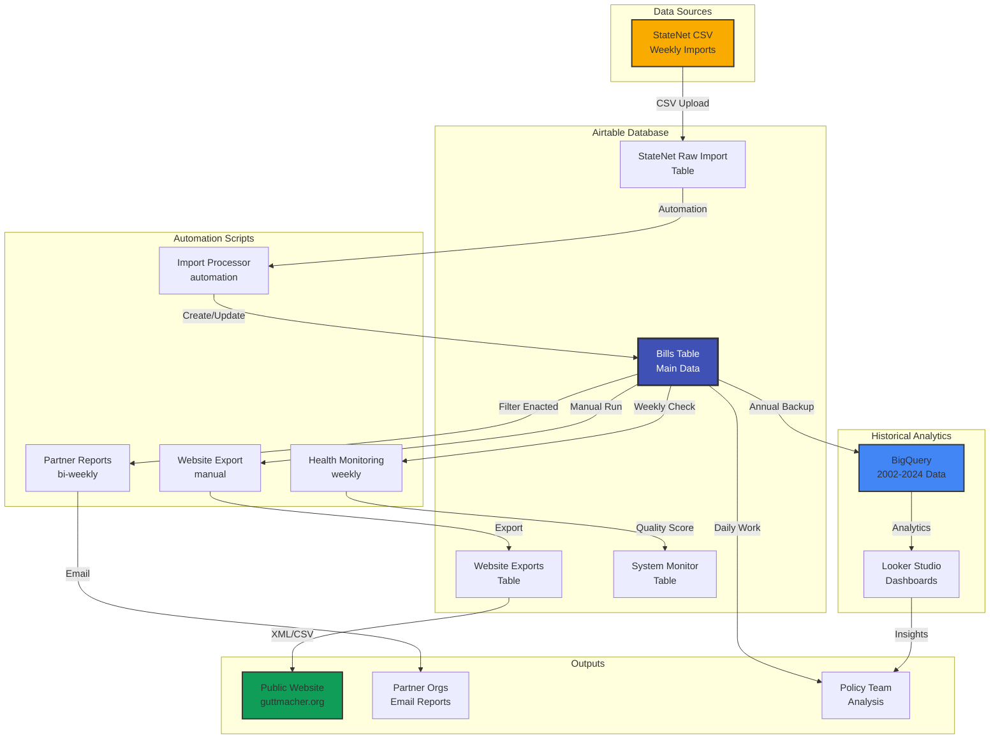
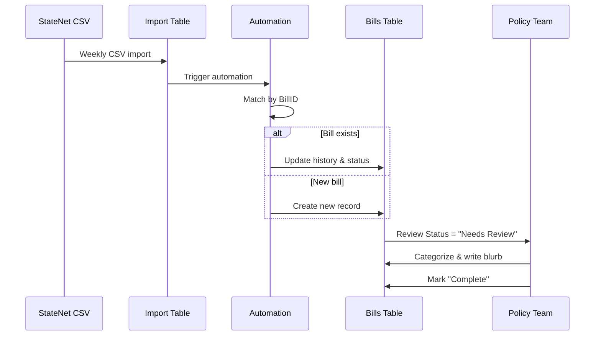
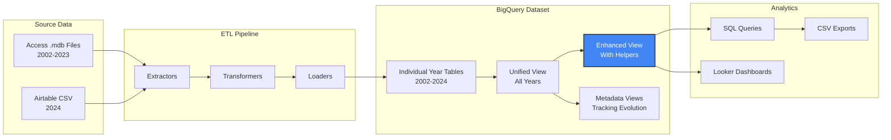
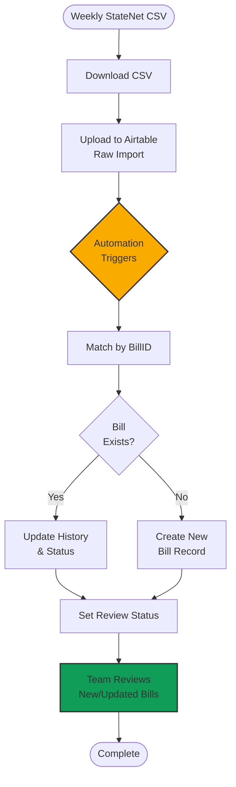
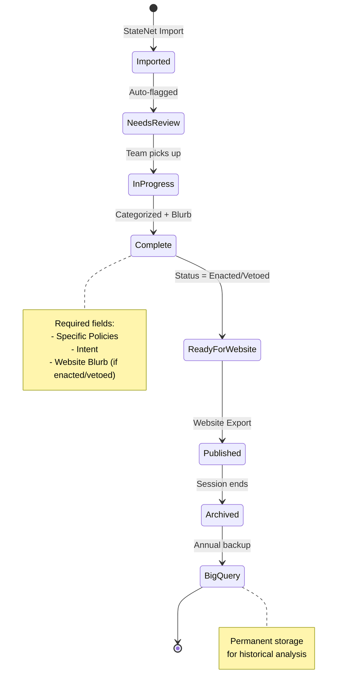

# System Architecture

Understanding how the Guttmacher Legislative Tracker components work together.

## High-Level Architecture



## Component Overview

### 1. Data Input: StateNet

**What it is**: Third-party legislative tracking service

**How it works**:
- Monitors all 50 state legislatures
- Sends daily email alerts based on custom search terms
- Provides weekly CSV exports of tracked bills

**Key fields**:
- Jurisdiction (state)
- Bill Type & Number
- Summary (bill description)
- Last Status Date (legislative history)
- Policy category flags

**Frequency**: Daily alerts, weekly bulk imports

---

### 2. Operational Database: Airtable

The heart of the system - a structured relational database.

#### Main Tables

**StateNet Raw Import** 📥
- **Purpose**: Landing zone for CSV imports
- **Automation**: Triggers bill creation/updates
- **Retention**: Current session data

**Bills** 🏛️
- **Purpose**: Master legislative data
- **Record count**: ~2,000 bills per session
- **Key workflows**: Review, categorization, blurb writing
- **Users**: Policy team (daily), Legal team (as needed)

**Website Exports** 🌐
- **Purpose**: Formatted data for public website
- **Update frequency**: As needed (typically after enacted bills accumulate)
- **Format**: Transformed to match website requirements

**System Monitor** 📊
- **Purpose**: Data quality tracking
- **Update frequency**: Weekly automated
- **Metrics**: Quality score, missing data flags, anomaly detection

**Policy Categories** 🏷️
- **Purpose**: Master policy taxonomy
- **Structure**: Categories → Subcategories → Headers → Specific Policies
- **Update frequency**: Rarely (policy taxonomy is stable)

#### Data Flow



---

### 3. Automation Scripts

#### Process StateNet Import (Automation)
- **Trigger**: New record in Raw Import table
- **Action**: Create or update Bills record
- **Frequency**: Real-time (on import)

#### Health Monitoring (Weekly)
- **Location**: `airtable-scripts/health-monitoring/`
- **Schedule**: Every Monday 6am
- **Function**: Calculate data quality score, flag issues
- **Output**: Record in System Monitor table

#### Partner Email Report (Bi-weekly)
- **Location**: `airtable-scripts/partner-email-report/`
- **Schedule**: 1st and 15th of month
- **Function**: Generate HTML/text report of enacted/vetoed bills
- **Recipients**: Partner organizations

#### Website Export (Manual)
- **Location**: `airtable-scripts/website-export/`
- **Trigger**: Manual run by staff
- **Function**: Transform Bills → Website Exports format
- **Output**: CSV file for web team

---

### 4. Historical Analytics: BigQuery

#### Purpose
Long-term storage and analysis of 22 years of legislative data (2002-2024)

#### Architecture



#### Key Views

**all_historical_bills_unified**
- Union of all year tables
- Raw data, no transformations
- Best for custom analysis

**comprehensive_bills_authentic**
- Enhanced with calculated fields
- Geographic groupings (region)
- Status summaries
- Best for dashboards

**raw_data_tracking_by_year**
- Metadata view showing what was tracked when
- Essential for understanding data gaps
- Used for methodology documentation

#### Update Frequency
- **Historical data**: One-time migration (complete)
- **Current year**: Annual append (end of session)
- **Schema changes**: As needed (rare)

---

### 5. Outputs & Integrations

#### Public Website

**URL**: [guttmacher.org tracker](https://states.guttmacher.org/policies/)

**Data flow**:
```
Bills Table → Website Export Script → Website Exports Table → CSV → Web Team → Website
```

**Update frequency**: As needed (when enacted bills accumulate)

**Format**: XML or CSV (web team's choice)

#### Partner Reports

**Recipients**:
- SiX (full report)
- ACN/NAF (abortion-only)
- Other partners as needed

**Schedule**: 1st and 15th of month

**Content**:
- Recently enacted/vetoed bills
- Bill details and website blurbs
- Formatted HTML email + plain text

#### Internal Analysis

**Tools**:
- Airtable views and filters (current session)
- BigQuery queries (historical trends)
- Looker Studio dashboards (visualization)

**Users**:
- Policy team: Daily tracking, categorization
- Research team: Analysis for reports and papers
- Communications: Data for press releases and media requests

---

## Technology Stack

### Production Systems

| Component | Technology | Purpose |
|-----------|------------|---------|
| Operational Database | Airtable (Teams Plan) | Real-time bill tracking |
| Automation Runtime | Airtable Scripting | JavaScript automation scripts |
| Historical Data | Google BigQuery | 22-year data warehouse |
| Dashboards | Looker Studio | Data visualization |
| Version Control | GitHub | Code and documentation |

### Development Tools

| Tool | Purpose |
|------|---------|
| Python 3.11+ | ETL pipeline scripts |
| Pandas | Data transformation |
| PyYAML | Configuration management |
| MkDocs Material | Documentation site |
| Git | Version control |

### Cloud Infrastructure

**Google Cloud Platform (GCP)**:
- **Project**: `guttmacher-legislative-tracker`
- **Region**: `us-east-1`
- **BigQuery Dataset**: `legislative_tracker_historical`
- **Storage**: Cloud Storage for backups

---

## Data Workflows

### Weekly StateNet Import



### Bill Lifecycle



---

## Security & Access Control

### Airtable Access Levels

| Role | Access Level | Who |
|------|-------------|-----|
| **Owners** | Full admin | Lenny Munitz |
| **Creators** | Create bases | Fryda Guedes |
| **Editors** | Edit data | Policy team |
| **Commenters** | Comment only | (not used) |
| **Read-only** | View only | External partners (via interfaces) |

### BigQuery Access

**Project-level**: `guttmacher-legislative-tracker`

**Access control**:
- View only: Policy/research team
- Edit: Technical team (Fryda)
- Admin: IT (Lenny)

### GitHub Repository

**Visibility**: Private (not public)

**Access**:
- Admin: Fryda Guedes
- Read: Policy team (as needed)

---

## Scalability & Performance

### Current Scale
- **Bills per year**: ~2,000
- **Total historical records**: 22,459
- **Airtable size**: ~15,000 records (active session)
- **BigQuery size**: 22 years, <100MB

### Performance Considerations

**Airtable limitations**:
- 30-second script timeout
- 5 requests/second rate limit
- 50,000 records per base (on Teams plan)

**Mitigations**:
- Batch operations in chunks of 50
- Add delays between batches (200ms)
- Archive old sessions to BigQuery

**BigQuery performance**:
- Materialized views for common queries
- Partitioning by year (future consideration)
- Query optimization (filter early, select specific columns)

---

## Disaster Recovery

### Backup Strategy

**Airtable**:
- Built-in 30-day recovery
- Manual CSV exports (weekly)
- BigQuery serves as backup (annual)

**BigQuery**:
- Automatic Google Cloud backups (7 days)
- Version control via table snapshots
- Export capability to Cloud Storage

### Recovery Procedures

See [Runbook: Emergency Procedures](../technical/runbook.md#emergency-procedures) for:
- Data deletion recovery
- Script failure rollback
- Website export corruption

**Historical recovery example**: [December 2025 Incident](https://github.com/Frydafly/guttmacher-legislative-tracker/blob/main/INCIDENTS.md)

---

## Future Considerations

### Potential Enhancements

**Airtable**:
- Regulations tracking (proposed, see [Planning](../planning/regulations-tracking.md))
- Enhanced dashboards/interfaces
- Additional automation scripts

**BigQuery**:
- Annual data append automation
- More Looker dashboards
- Public data API (if desired)

**Integration**:
- Direct Airtable → BigQuery sync (instead of annual)
- Real-time analytics
- Automated website updates

### Migration Path

If Airtable becomes limiting:
- **Softr.io**: Frontend for Airtable with better UX
- **Custom database**: PostgreSQL + Web app
- **Airtable Enterprise**: Higher limits, better features

Current assessment: **Airtable Teams plan is sufficient** for foreseeable needs.

---

**Questions about architecture?** See [Getting Help](../index.md#getting-help) for contacts.
