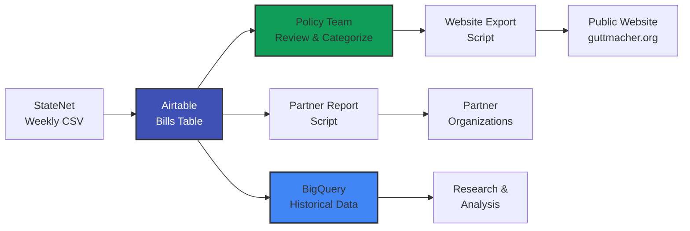

# System Overview

The Guttmacher Legislative Tracker is a comprehensive system for monitoring, analyzing, and reporting on state-level reproductive health legislation across all 50 US states.

## What Does It Do?

### Core Functions

**📊 Track** - Monitor all state legislation related to sexual and reproductive health
- 2,000+ bills per legislative session
- All 50 states
- Multiple policy areas (abortion, contraception, insurance, etc.)

**🔍 Analyze** - Categorize and understand policy trends
- Policy area classification
- Intent analysis (protective vs. restrictive)
- Status tracking (introduced → enacted/failed)

**📰 Report** - Generate outputs for multiple audiences
- Public-facing website content
- Partner organization reports
- Internal research and analysis

**📈 Preserve** - Maintain historical data for trend analysis
- 22 years of data (2002-2024)
- 22,459 total bills tracked
- Available for research queries

---

## Who Uses It?

### Policy Team (Daily Users)
**Mollie Fairbanks, Talia Curhan**

**Tasks**:
- Import weekly StateNet data
- Review and categorize new bills
- Write website blurbs for enacted/vetoed legislation
- Generate partner reports

**Primary interface**: Airtable Bills table

---

### Legal Team (As Needed)
**Kimya Forouzan**

**Tasks**:
- Review complex bills for legal accuracy
- Verify policy categorization
- Consult on blurb language

**Primary interface**: Airtable Bills table (review workflow)

---

### Research & Communications (Analysts)
**Various team members**

**Tasks**:
- Query historical trends
- Generate statistics for reports and papers
- Create data visualizations
- Answer media requests

**Primary interface**: BigQuery + Looker Studio

---

### Web Team (Recipients)
**Lenny Munitz, Devan Martin, Louis Guzik**

**Tasks**:
- Receive exported data
- Update public tracker website
- Maintain website infrastructure

**Primary interface**: CSV/XML exports from Airtable

---

### Technical Maintenance
**Fryda Guedes**

**Tasks**:
- Deploy script updates
- Monitor data quality
- Maintain BigQuery pipeline
- Troubleshoot issues

**Primary interface**: GitHub + Airtable + BigQuery

---

## System Components

### 1. Airtable Database (Operational)

**Purpose**: Day-to-day bill tracking and processing

**Main tables**:
- **Bills** - Master legislative data (~2,000 current session records)
- **StateNet Raw Import** - Landing zone for CSV imports
- **Website Exports** - Formatted data for public website
- **System Monitor** - Data quality tracking
- **Policy Categories** - Master policy taxonomy

**Access**: Web-based, collaborative, real-time

**Users**: Policy team, legal team, technical team

**→ [User Manual](../user-guides/airtable-user-manual.md)**

---

### 2. Automation Scripts (Processing)

**Purpose**: Automate repetitive tasks and ensure data quality

**Scripts**:

**Health Monitoring** (Weekly)
- Calculates data quality score
- Flags missing or invalid data
- Runs every Monday at 6am

**Partner Email Report** (Bi-weekly)
- Generates HTML/text reports
- Sends to partner organizations
- Runs 1st and 15th of month

**Website Export** (Manual)
- Transforms data for website
- Validates before export
- Run by staff as needed

**Import Processor** (Real-time)
- Creates/updates Bills from StateNet imports
- Runs automatically on new imports

**→ [Deployment Guide](../technical/deployment-guide.md)**

---

### 3. BigQuery Data Warehouse (Historical)

**Purpose**: Long-term storage and analysis of 22 years of data

**Contents**:
- 22,459 bills from 2002-2024
- Individual year tables
- Unified views across all years
- Metadata views for methodology tracking

**Access**: SQL queries via BigQuery Studio

**Users**: Research team, analysts, policy team

**→ [BigQuery for Analysts](../user-guides/bigquery-for-analysts.md)**

---

## Data Flow

**→ [Detailed Architecture](architecture.md)**

---

## Key Features

### Automated Data Processing
- StateNet imports automatically create/update bills
- Status tracking via formula extraction from history
- Date parsing and validation
- Quality monitoring and alerting

### Collaborative Workflow
- Multiple team members work simultaneously
- Review status tracking (Needs Review → In Progress → Complete)
- Comments and notes fields
- Audit trails (who updated when)

### Policy Categorization
- Hierarchical taxonomy (Category → Subcategory → Header → Specific Policy)
- Multiple policies per bill supported
- Intent classification (Protective, Restrictive, Neutral)
- Consistent categorization across years

### Quality Assurance
- Weekly automated health checks
- Pre-flight validation before exports
- Date validation formulas
- Missing data flagging

### Historical Analysis
- 22 years of comparable data
- Methodology evolution documented
- Trend analysis capabilities
- Cross-state comparisons

---

## Technology Stack

| Component | Technology |
|-----------|------------|
| **Operational Database** | Airtable (Teams Plan) |
| **Automation** | JavaScript (Airtable Scripting) |
| **Historical Data** | Google BigQuery |
| **Visualization** | Looker Studio |
| **Version Control** | GitHub |
| **Documentation** | MkDocs Material |

**→ [Technical Architecture](architecture.md#technology-stack)**

---

## Project Philosophy

!!! quote "Pragmatic & Sustainable"
    This system follows a **"simple > perfect"** philosophy focused on:

    **✅ Reliability** - Works consistently without constant maintenance

    **✅ Clarity** - Easy to understand and use

    **✅ Maintainability** - Can be maintained by small team

    **❌ Over-engineering** - Avoid building tools for rare use cases

### Decision Framework

Before building any new feature, ask:

1. **How often does this occur?**
   - Rare = Handle manually
   - Monthly = Simple script
   - Weekly+ = Automate fully

2. **Can we solve with existing tools?**
   - Use Airtable views instead of custom scripts
   - Use comments instead of new fields
   - Use checklists instead of automation

3. **Who maintains this when you're gone?**
   - Document clearly
   - Keep it simple
   - Avoid dependencies on you

---

## Getting Started

**New to the system?**
1. Start with [Quick Start Guide](quick-start.md)
2. Read relevant user manual:
   - [Airtable User Manual](../user-guides/airtable-user-manual.md) for policy team
   - [BigQuery for Analysts](../user-guides/bigquery-for-analysts.md) for researchers
3. Understand [Architecture](architecture.md)
4. Bookmark [Runbook](../technical/runbook.md) for troubleshooting

**Experienced user?**
- Jump to [Reference](../reference/data-dictionary.md) for field details
- Check [Technical Docs](../technical/deployment-guide.md) for deployment
- Browse [Historical Data](../historical/bigquery-migration.md) for analysis

---

## Recent Milestones

**December 2025** - Successfully recovered from data deletion incident using BigQuery backups

**July 2025** - Completed migration of 22 years of historical data to BigQuery

**June 2025** - Deployed enhanced website export with quality metrics

**January 2025** - Launched new Airtable-based system replacing Access database

**December 2024** - Initial project kickoff and requirements gathering

---

## Questions?

See [Getting Help](../index.md#getting-help) for contacts and resources.
