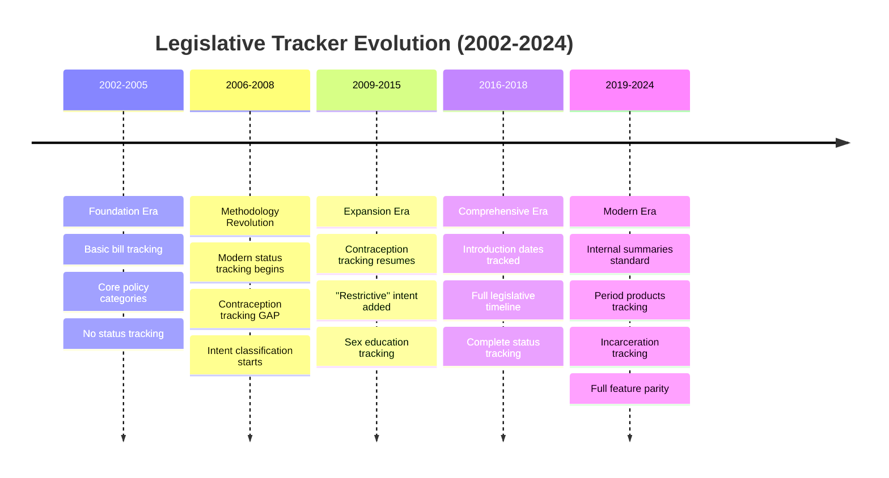

# Historical Data Evolution

Understanding how legislative tracking methodology evolved from 2002-2024.

!!! warning "Critical for Historical Analysis"
    Data collection methods changed significantly over 22 years. Understanding these changes is **essential** for accurate historical analysis.

## Timeline Overview



---

## Era Breakdowns

### Foundation Era (2002-2005)

**What was tracked**:
✅ State, Bill Number, Description
✅ Last Action Date
✅ Core policies: Abortion (29-51%), some contraception
✅ Basic bill identification

**What was NOT tracked**:
❌ Bill Types (H vs S vs A)
❌ Introduction dates
❌ Modern status classifications
❌ Intent (protective/restrictive/neutral)
❌ Systematic contraception tracking
❌ Many emerging policy areas

**Record volume**: 177-182 bills/year

**Best for**: Understanding early policy landscape, geographic patterns

**NOT suitable for**: Status/outcome analysis, date-based timelines

---

### Methodology Revolution (2006-2015)

**Major breakthrough in 2006**: Modern legislative status tracking

**2006 Revolution - What Changed**:
✅ Bill Type classification (99%+ coverage)
✅ Modern status fields (introduced, dead, pending, enacted)
✅ Intent classification begins (positive/neutral)
✅ Better data structure

**CRITICAL GAP: 2006-2008**
❌ **Contraception tracking completely stopped**
- 0 contraception TRUE values these years
- Resumed in 2009
- **Filter out 2006-2008 for contraception analysis!**

**2009 Enhancement**:
✅ "Restrictive" intent added (completing protective/neutral/restrictive)
✅ Contraception tracking resumed
✅ Emergency contraception tracking begins

**Record volume**: 801-1,185 bills/year (huge increase)

**Best for**: Modern status analysis (2006+), policy categorization

**NOT suitable for**: Date-based analysis (no intro dates), contraception trends (gap years)

---

### Comprehensive Era (2016-2018)

**2016 Breakthrough**: Introduction date tracking

**What improved**:
✅ Introduction dates tracked systematically (95-99%+)
✅ **Complete legislative timeline** for first time
✅ Can now analyze from introduction → outcome
✅ All modern features in place

**Record volume**: 1,039-1,185 bills/year

**Best for**: Full lifecycle analysis, timeline studies, comprehensive reporting

**Suitable for**: Essentially all modern analyses

---

### Modern Era (2019-2024)

**2019 Maturation**: System reaches full capability

**What's new**:
✅ Internal summaries become standard (67-96% coverage)
✅ Period products tracking begins
✅ Incarceration tracking begins
✅ Emerging policy areas systematically tracked

**2023 Peak**: 2,254 bills - highest single year volume ever

**2024 transition**: Migration from Access to Airtable

**Record volume**: 1,311-2,254 bills/year

**Best for**: Everything - full data richness

---

## Critical Methodology Changes

### 2006 Status Revolution

**Before 2006**:
- Different status methodology
- Not directly comparable to modern tracking
- Limited outcome data

**After 2006**:
- Modern boolean status fields (introduced, dead, pending, enacted, etc.)
- Consistent with current Airtable structure
- Reliable outcome tracking

!!! danger "Do Not Compare Across 2006"
    **DO NOT** compare enactment rates or outcomes between pre-2006 and post-2006 data. The methodologies are incompatible.

    ❌ **Bad**: "Enactment rate increased from 15% (2005) to 25% (2007)"
    ✅ **Good**: "From 2006-2024, enactment rate averaged 23%"

---

### 2006-2008 Contraception Gap

**The Gap**:
- Contraception field exists but shows 0% TRUE values
- Contraception bills were NOT being tracked
- Complete data gap for this policy area

**Why it happened**: Unknown (likely methodology change during 2006 revolution)

**Resolution**: Tracking resumed in 2009

!!! danger "Filter Out Gap Years"
    For contraception analysis, use:
    ```sql
    WHERE year NOT BETWEEN 2006 AND 2008
    ```

---

### 2016 Introduction Date Revolution

**Before 2016**:
- No introduction dates tracked
- NULL for all records
- Cannot analyze bill lifecycle

**After 2016**:
- 95-99%+ coverage of introduction dates
- Full timeline from intro → final outcome
- Can calculate days in legislature, session timing, etc.

!!! info "Date-Based Analysis"
    Only use data from **2016+** for analyses requiring introduction dates, legislative timelines, or session timing.

---

## Data Quality by Era

### Field Availability Matrix

| Field | 2002-2005 | 2006-2015 | 2016-2018 | 2019-2024 |
|-------|-----------|-----------|-----------|-----------|
| **State** | ✅ 100% | ✅ 100% | ✅ 100% | ✅ 100% |
| **Bill Number** | ✅ 100% | ✅ 100% | ✅ 100% | ✅ 100% |
| **Description** | ✅ 100% | ✅ 100% | ✅ 100% | ✅ 100% |
| **Bill Type** | ❌ 0% | ✅ 99%+ | ✅ 99%+ | ✅ 98%+ |
| **Introduction Date** | ❌ 0% | ❌ 0% | ✅ 95%+ | ✅ 99%+ |
| **Last Action** | ✅ 100% | ⚠️ Gap 06-08 | ✅ 100% | ✅ 100% |
| **Status (modern)** | ❌ Different | ✅ Yes | ✅ Yes | ✅ Yes |
| **Intent** | ❌ No | ⚠️ Partial | ✅ Complete | ✅ Complete |
| **Abortion** | ✅ 29-51% | ✅ 32-42% | ✅ 40-46% | ✅ 37-43% |
| **Contraception** | ⚠️ Some | ❌ Gap 06-08 | ✅ Yes | ✅ Yes |
| **Internal Summary** | ❌ Sparse | ❌ Sparse | ⚠️ Improving | ✅ 67-96% |
| **Period Products** | ❌ No | ❌ No | ❌ No | ✅ 2019+ |

Legend:
- ✅ Available & reliable
- ⚠️ Partial or improving
- ❌ Not available/tracked

---

## NULL vs FALSE - Critical Distinction

### What It Means

**NULL** = Field didn't exist that year (not tracked at all)
**FALSE** = Field existed and was tracked, but this bill was marked negative
**TRUE** = Field existed and was tracked, bill was marked positive

### Example: Contraception Field

**Year 2005**: `contraception = NULL`
- Field didn't exist yet
- Cannot determine if bill was about contraception

**Year 2007**: `contraception = NULL`
- Field exists but contraception not tracked (gap years)
- Cannot determine if bill was about contraception

**Year 2010**: `contraception = FALSE`
- Field exists and tracked
- This specific bill was NOT about contraception

**Year 2015**: `contraception = TRUE`
- Field exists and tracked
- This bill WAS about contraception

### Why This Matters

!!! danger "Common Mistake"
    ```sql
    -- ❌ WRONG - Includes years when not tracked
    SELECT COUNT(*) as contraception_bills
    FROM bills
    WHERE contraception = TRUE;

    -- ✅ CORRECT - Filters out NULL (not tracked) years
    SELECT COUNT(*) as contraception_bills
    FROM bills
    WHERE contraception = TRUE
      AND contraception IS NOT NULL;
    ```

---

## Recommended Analysis Timeframes

### By Research Question

**"How has X changed over time?"**
- Use: 2006-2024 (modern status tracking)
- Excludes: 2002-2005 (different methodology)

**"What percentage of bills are enacted?"**
- Use: 2006-2024 (reliable status)
- Be careful: 2006-2008 have fewer bills tracked

**"How long does it take from introduction to enactment?"**
- Use: 2016-2024 (introduction dates available)
- Excludes: All earlier years (no intro dates)

**"How has contraception legislation evolved?"**
- Use: 2002-2005, 2009-2024
- **Excludes**: 2006-2008 (gap years)

**"Comparing multiple policy areas"**
- Use: 2019-2024 (most comprehensive)
- Or: 2016-2024 (good compromise)

---

## Field Evolution Examples

### Bill Type Field

**History**:
- 2002-2005: Field doesn't exist (NULL)
- 2006+: Field tracked (H, S, A, SJR, etc.)

**Values**:
- H (House), S (Senate), A (Assembly)
- SJR, HJR (Joint Resolutions)
- CACR, SCR, ACR (Concurrent Resolutions)
- Others: D, SR, HM, HD, LSR

---

### Policy Category Evolution

**Field name changes**:
- "Teen Issues" (2005) → "Minors" (2010+)
- "Family Planning/MCH" (2005) → "Contraception" (2015+)
- "EC" (2009) → "Emergency Contraception" (2015+)

**New categories added**:
- Period Products (2019+)
- Incarceration (2019+)

---

### Status Field Evolution

**2002-2005**: Different status system
- Not directly mappable to modern statuses
- Limited outcome tracking

**2006+**: Modern boolean fields
- introduced, dead, pending, enacted, vetoed
- Consistent through present

---

## Using the Tracking Views

### raw_data_tracking_by_year (BigQuery View)

**Purpose**: Shows what was actually tracked vs what was marked TRUE each year

**Key columns**:
- `year`
- `total_bills`
- `[field]_tracking_pct` - % of bills where field was tracked (not NULL)
- `[field]_true_when_tracked_pct` - Of tracked bills, % marked TRUE

**Example query**:
```sql
SELECT
  year,
  total_bills,
  contraception_tracking_pct,
  contraception_true_when_tracked_pct
FROM `guttmacher-legislative-tracker.legislative_tracker_historical.raw_data_tracking_by_year`
ORDER BY year;
```

**Sample output**:
| Year | Bills | Contra Tracking% | Contra True% |
|------|-------|------------------|--------------|
| 2005 | 182 | 51.1% | 18.3% |
| 2006 | 1099 | 0.0% | - |
| 2007 | 1127 | 0.0% | - |
| 2008 | 1010 | 0.0% | - |
| 2009 | 883 | 100.0% | 12.5% |

---

## Best Practices for Historical Analysis

### 1. Always Check Data Availability First

Before running analysis:
```sql
-- Check if field was tracked for your time period
SELECT
  year,
  COUNTIF([field] IS NOT NULL) as tracked,
  COUNT(*) as total
FROM bills
WHERE year BETWEEN [start] AND [end]
GROUP BY year;
```

### 2. Filter Out NULL Years

```sql
-- Always use IS NOT NULL for policy fields
WHERE [policy_field] IS NOT NULL
  AND [policy_field] = TRUE
```

### 3. Document Methodology in Reports

Include footnotes like:
> "Analysis includes 2006-2024 data. Earlier years use different status methodology and are not comparable. Contraception data excludes 2006-2008 due to tracking gap."

### 4. Use Appropriate Views

- **Raw data**: `all_historical_bills_unified`
- **With helpers**: `comprehensive_bills_authentic`
- **Methodology checks**: `raw_data_tracking_by_year`

---

## Migration Documentation

For details on how historical data was migrated to BigQuery, see:
- [BigQuery Migration Report](bigquery-migration.md)
- [Field Mappings YAML](https://github.com/Frydafly/guttmacher-legislative-tracker/blob/main/bigquery/schema/field_mappings.yaml)

---

## Questions About Data Evolution?

**Contact**:
- Historical data questions: Contact the technical team
- Policy methodology: Contact the policy team or legal team
- Analysis guidance: See [BigQuery for Analysts](../user-guides/bigquery-for-analysts.md)
