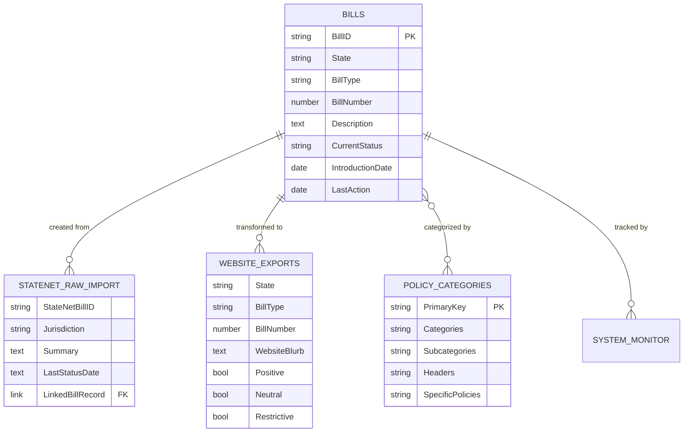

# Airtable Schema Reference

Quick reference for the Airtable base structure and key fields.

!!! info "Full Details"
    For complete field documentation including automations and formulas, see the [Data Dictionary](data-dictionary.md).

## Terminology

### Project Names

- **Guttmacher Legislative Tracker**: The overall project name (used in repository, documentation, BigQuery project)
- **Policy Tracker**: The name of the Airtable base
- **Legislative Tracker**: Alternate name for the system (used interchangeably)

### Table Names

The Airtable base contains the following tables:

| Table Name | Purpose | Common Reference |
|------------|---------|------------------|
| **Bills** | Master legislative tracking | Main table, Bills table |
| **StateNet Raw Import** | Landing zone for CSV imports | Import table, Raw imports |
| **System Monitor** | Health check results and quality scores | Monitor table |
| **Website Exports** | Formatted data for public website | Exports table |
| **Policy Categories** | Master policy taxonomy | Categories table |
| **Regulations** | Administrative rules and emergency regulations | Regulations table |

### Key Terms

- **BillID**: Primary unique identifier (format: `STATE-BILLTYPE-NUMBER`, e.g., `TX-HB-123`)
- **Intent**: Classification as Positive, Neutral, or Restrictive
- **Specific Policies**: Linked policy categories (e.g., Abortion, Contraception)
- **Website Blurb**: Public-facing summary (required for enacted/vetoed bills)
- **Review Status**: Internal workflow status (Needs Review, In Progress, Complete)
- **Current Bill Status**: Legislative status (Introduced, In Committee, Enacted, Failed, etc.)

### System Names

- **StateNet**: Third-party legislative monitoring service (provides CSV imports)
- **BigQuery**: Google Cloud data warehouse for historical analytics
- **Looker Studio**: Visualization platform for BigQuery data

## Tables Overview

### Bills (Main Table)

The heart of the system - tracks all legislative bills.

**Purpose**: Master legislative tracking and categorization

**Record count**: ~2,000 per session

**Key field groups**:
- Identification (BillID, State, BillType, BillNumber)
- Content (Description, Website Blurb, Internal Notes)
- Dates (Introduction, Last Action, Enacted, Effective)
- Classification (Intent, Specific Policies, Action Type)
- Status (Current Bill Status, Review Status)
- System (Import Date, Last Updated, Linked Records)

---

### StateNet Raw Import

Landing zone for StateNet CSV imports.

**Purpose**: Initial import before processing to Bills table

**Automation**: Triggers "Process StateNet Import" on new records

**Key fields**:
- StateNet Bill ID (becomes BillNumber)
- Jurisdiction (becomes State)
- Summary (becomes Description)
- Last Status Date (becomes History)
- Linked Bill Record (links to Bills table)

---

### Website Exports

Formatted data for public website.

**Purpose**: Transform Bills data to website-ready format

**Created by**: Website Export script

**Key transformations**:
- Specific Policies → Subpolicy1-10 fields
- Intent → Positive/Neutral/Restrictive binary flags
- Dates formatted for website

---

### Policy Categories

Master taxonomy of policy categorizations.

**Purpose**: Structured policy hierarchy

**Structure**:
```
Categories (e.g., "Abortion")
  └── Subcategories (e.g., "Abortion bans")
      └── Headers (e.g., "Gestational duration ban")
          └── Specific Policies (e.g., "24wk or viability ban")
```

**Usage**: Bills link to Specific Policies, which auto-populate parent categories

---

### System Monitor

Data quality tracking.

**Purpose**: Track system health over time

**Updated by**: Health Monitoring script (weekly)

**Key metrics**:
- Quality score (0-100)
- Bills tracked
- Issues found
- Field completion rates

---

## Key Fields Explained

### BillID (Formula)

**Format**: `{State}-{BillType}-{BillNumber}`

**Example**: `TX-H-1` (Texas House Bill 1)

**Purpose**: Unique identifier for each bill

**Formula**: Concatenates State, BillType, and BillNumber

---

### Current Bill Status (Formula)

**Values**:
- Introduced
- Dead
- Legislature Adjourned
- Passed First Chamber
- Awaiting Concurrence
- Passed Both Chambers
- In Conference
- Enacted
- Vetoed

**Logic**: Derived from History field using complex formula

**→ See**: [Airtable Formulas](airtable-formulas.md) for date extraction formulas

---

### Intent (Single Select)

**Values**:
- Protective
- Restrictive
- Neutral

**Purpose**: Classify bill's impact on reproductive health access

**Usage**:
- Protective = Expands/protects access
- Restrictive = Limits/restricts access
- Neutral = Neither clearly protective nor restrictive

---

### Specific Policies (Linked Records)

**Type**: Multi-select link to Policy Categories table

**Purpose**: Categorize bill by specific policy areas

**Auto-populates**:
- Policy Categories
- Subcategories
- Headers
- Category Intent

**Example**: Bill about medication abortion restrictions might have:
- "Medication abortion prohibitions"
- "Telehealth abortion restrictions"

---

### Date Fields

**Formula-extracted** (automatic):
- Introduction Date Formula → Introduction Date
- Last Action Date Formula → Last Action
- Enacted Date Formula → Enacted Date

**Manual entry**:
- Effective Date
- Passed Legislature Date

**Format**: MM/DD/YYYY

**Validation**: Date Validation field flags future dates

---

### Website Blurb (Long Text)

**Purpose**: Public-facing description for enacted/vetoed bills

**Used by**: Website Export script (only exports bills with status "Enacted" or "Vetoed" AND filled Website Blurb)

**Content Structure**:

Most website blurbs follow this structure:

**Template**: "[Month], [Governor name (Party)] [action] legislation ([Bill ID]) that [policy description]. [Effective date if known]."

**Example**:
> "In April, Governor Smith (R) signed legislation (S 102) that expands Medicaid eligibility for prenatal care. The law takes effect in October."

**Technical note**: Content from this field is exported as plain text to the public website. Your team's editorial process determines which bills receive website blurbs.

---

## Field Naming Conventions

### Airtable Field Names
- Use spaces and proper capitalization: `Last Action Date`
- Avoid special characters except hyphens
- Keep names descriptive but concise

### CONFIG Object (in scripts)
```javascript
const CONFIG = {
  FIELD_NAMES: {
    BILL_ID: 'BillID',           // Exact match to Airtable
    STATE: 'State',              // Case-sensitive
    CURRENT_STATUS: 'Current Bill Status',  // Include spaces
  }
};
```

!!! warning "Case Sensitivity"
    Field names in scripts must match Airtable **exactly**, including capitalization and spaces.

---

## Table Relationships



---

## Views & Filters

### Common Views

**Needs Review**
```
Filter: Review Status = "Needs Review"
Sort: Import Date (newest first)
```

**Ready for Website**
```
Filter: Current Bill Status = "Enacted" OR "Vetoed"
Filter: Website Blurb is not empty
Sort: Last Action (newest first)
```

**Current Year**
```
Filter: Year = 2025  (formula field extracts from Introduction Date)
Group: State
```

**Restrictive Bills**
```
Filter: Intent = "Restrictive"
Group: Specific Policies
```

---

## Automation Triggers

### Process StateNet Import
**When**: Record created in StateNet Raw Import
**Action**: Create or update Bills record
**Fields mapped**:
- StateNet Bill ID → BillNumber
- Jurisdiction → State
- Summary → Description
- Last Status Date → History

### Date Extraction
**When**: History field updated
**Action**: Update date formula fields
**Triggers**:
- Introduction Date extraction
- Last Action Date extraction
- Enacted Date extraction

### Category Population
**When**: Specific Policies updated
**Action**: Auto-populate related category fields
**Populates**:
- Policy Categories
- Subcategories
- Headers
- Category Intent

---

## Data Validation

### Built-in Validation

**Date Validation** (Formula field)
Flags records with:
- Future dates
- Invalid date formats
- Impossible date combinations

Shows: 🚫 emoji for invalid dates

### Quality Checks (Health Monitoring Script)

**Checks**:
- Missing website blurbs for enacted/vetoed bills
- Incomplete policy categorization
- Empty required fields
- Status inconsistencies

**Output**: System Monitor table

---

## Schema Changes

### How to Modify Fields

!!! danger "Before Changing Field Names"
    If a field is referenced in scripts, you must:

    1. Update CONFIG object in **all** affected scripts
    2. Test scripts in development
    3. Deploy updated scripts
    4. **Then** rename field in Airtable

### Adding New Fields

1. Create field in Airtable
2. Populate existing records (if needed)
3. Update Data Dictionary documentation
4. Update scripts if automation needed
5. Communicate to team

### Removing Fields

1. **Do NOT delete immediately**
2. Rename to "DEPRECATED - [FieldName]"
3. Remove from views
4. Update scripts to not reference
5. After 30 days, safe to delete

---

## Performance Considerations

### Field Limits (Airtable Teams Plan)

- **Records per base**: 50,000
- **Fields per table**: Unlimited (but slow >100 fields)
- **Linked records**: No hard limit
- **Attachments**: 5GB per base

### Current Usage
- Bills table: ~15,000 records (2 years of data)
- Well under limits
- Archive old sessions to BigQuery as needed

---

## Quick Reference

| Field Type | When to Use | Example |
|------------|-------------|---------|
| **Formula** | Auto-calculated | BillID, Current Bill Status |
| **Linked Record** | Relationships | Specific Policies → Policy Categories |
| **Single Select** | Fixed options | State, Intent, Review Status |
| **Multi-Select** | Multiple options | (rarely used, prefer Linked Records) |
| **Long Text** | Descriptions | Website Blurb, Internal Notes |
| **Date** | Dates | Introduction Date, Last Action |
| **Checkbox** | Boolean flags | Prefiled |
| **Auto** | System tracking | Import Date, Last Updated By |

---

**For complete field documentation**, see the [Data Dictionary](data-dictionary.md).

**For formula details**, see the [Formulas Reference](airtable-formulas.md).
